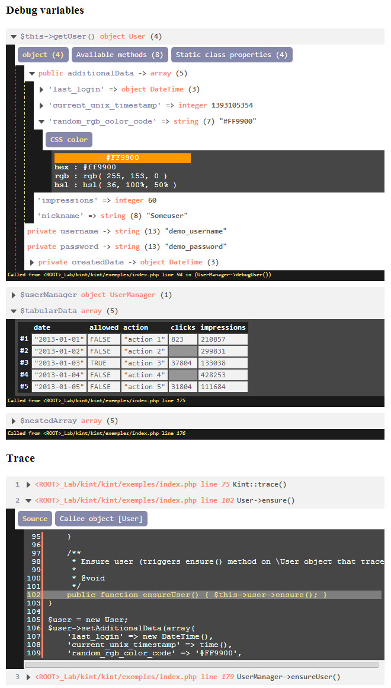

# Flatkint #

## About ##

Flatkint is a simple flat theme for Kint, the debugging helper for PHP developers.

[http://raveren.github.com/kint/](http://raveren.github.com/kint/)

## Design ##

## Installation ##

Flatkint is a Kint theme.

1. Placer le fichier `flatkint.css` fourni, à l'intérieur du répertoire `kint/view/inc/`
2. Préciser dans votre fichier config.php le paramètre suivant: `$_kintSettings['theme'] = 'flatkint';`